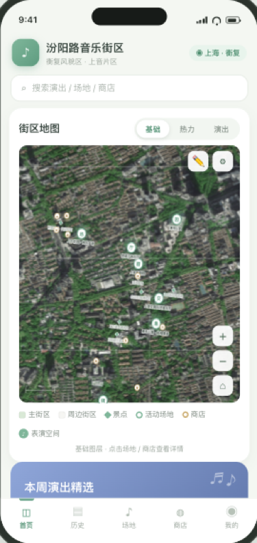
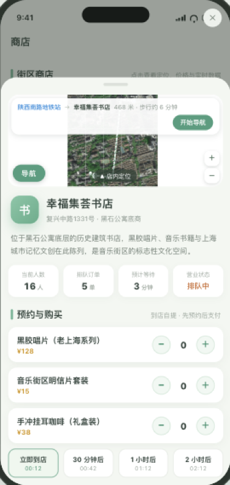
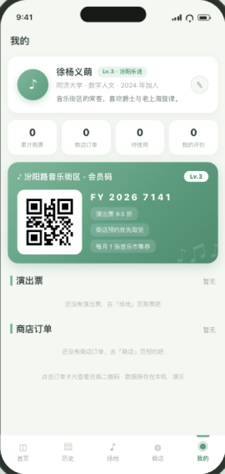

# ♪ 汾阳路音乐街区小程序

> 上海音乐学院汾阳路片区（衡复音乐街区）交互原型 · 微信小程序 + H5

一个以上海音乐学院所在街区为对象的**街区交互原型**：卫星地图街区漫游、演出时间表与实时倒计时、演出购票、商店预约下单、会员码与订单二维码——全部数据本地模拟，无后端依赖。

## ✨ 功能

- **街区地图**：微信原生地图（真机卫星底图）、拖动平移 / 双指或按钮缩放、场地与商店标记、点击标记跳详情
- **地图图层**：基础 / 热力（人群密度模拟）/ 演出（实时倒计时 callout）三种图层切换
- **演出**：场地时间表、距开演实时倒计时、人群密度与通行时间模拟、购票（海报票档 → 支付 → 取票码）
- **商店**：原生迷你地图、**导航路线**（最近地铁站 → 店铺折线 + 距离/步行时间）、预约下单（商品/到店时段/取件码）、附近演出推荐
- **我的**：个人信息（头像/昵称/简介可编辑）、会员码（本地生成二维码）、订单中心（演出票 + 商店订单，点开看兑换二维码）

## 🖼 截图

| 首页 · 卫星街区地图 | 场地列表 · 实时密度 | 商店 · 迷你地图导航 | 我的 · 会员码 |
|---|---|---|---|
|  |  |  |  |

> H5 原型在线演示：**[GitHub Pages 预览](https://xutom67-cyber.github.io/fenyang-music-block/)**（微信小程序需在开发者工具中运行）

## 📦 项目结构

```
├── index.html / app.js / style.css / data.js   # H5 交互原型（高德卫星瓦片）
├── calibrate.html / calibrate.js               # 地图校准页（瓦片对齐）
├── qrcode.js                                   # 二维码生成库（MIT）
├── images/                                     # 项目图纸与封面
└── miniprogram/                                # 微信小程序（完整原生迁移）
    ├── app.json                                # 5 个 tab：首页/历史/场地/商店/我的
    ├── components/map-view/                    # 原生地图组件（标记/导航折线/热力圈）
    ├── utils/                                  # 数据层 / 工具 / 二维码库
    └── pages/                                  # 11 个页面（splash→index→…→qr）
```

## 🚀 运行

**微信小程序**（推荐）：

1. 安装 [微信开发者工具](https://developers.weixin.qq.com/miniprogram/dev/devtools/download.html)（稳定版）
2. 导入项目 → 选择 `miniprogram/` 文件夹 → AppID 选「测试号」或自己的
3. 编译运行；手机查看：工具栏「预览」扫码（真机显示卫星底图）
4. 正式发布：注册个人小程序 AppID → 上传 → 审核 → 发布（**无需配置任何域名白名单**，无外部网络请求）

**H5 原型**：

```bash
python3 -m http.server 8137   # 静态预览（地图瓦片直连高德，需可访问高德图源）
# 浏览器打开 http://127.0.0.1:8137/index.html
```

## 🗺 技术说明

- 坐标体系：内容坐标 → 校准变换（旋转/缩放/偏移）→ 真实经纬度（GEO 仿射），标记与路线和真实世界对齐
- 地图：小程序端使用微信原生 `<map>` 组件（腾讯地图内置服务，正式版零域名配置）；H5 端为高德卫星瓦片 + 本地代理
- 二维码：本地生成（`utils/qrcode.js`，MIT），不依赖网络
- 数据：演出场次/人群密度/订单状态全部本地模拟，订单与资料存本地缓存（wx.setStorageSync）

## 📄 License

[MIT](./LICENSE) © 2026 徐杨义萌

---

*同济大学建筑学 · 数字人文方向 · 课程设计作品*
